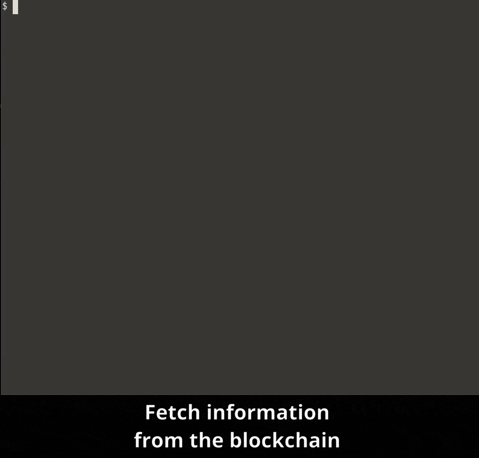

# eth-cli

A CLI swiss army knife for Ethereum developers

[](https://en.cryptobadges.io/donate/0xe8cdf02efd8ab0a490d7b2cb13553389c9bc932e)

[](https://travis-ci.org/protofire/eth-cli)
[](https://npmjs.org/package/eth-cli)
[](https://raw.githubusercontent.com/protofire/eth-cli/master/LICENSE)
[](https://david-dm.org/protofire/eth-cli)
[](https://david-dm.org/protofire/eth-cli?type=dev)

## Why use it?

`eth-cli` allows you to fetch data from the blockchain, start an interactive REPL connected to some node, call methods on deployed contracts, and more, all at the comfort of your command line. Checkout the [examples](#examples) below for more information or check the [full list of commands](docs/COMMANDS.md).

<!-- START doctoc generated TOC please keep comment here to allow auto update -->
<!-- DON'T EDIT THIS SECTION, INSTEAD RE-RUN doctoc TO UPDATE -->
## Table of Contents

- [Installation](#installation)
- [Demo](#demo)
- [Examples](#examples)
  - [Fetch data from the blockchain](#fetch-data-from-the-blockchain)
  - [Start an interactive REPL connected to some node](#start-an-interactive-repl-connected-to-some-node)
  - [Call methods on deployed contracts](#call-methods-on-deployed-contracts)
- [Sibling projects](#sibling-projects)
- [Back us](#back-us)
- [Credits](#credits)

<!-- END doctoc generated TOC please keep comment here to allow auto update -->

## Installation

Install it globally:

```shell
npm install -g eth-cli
```

You can also try it with `npx`:

```
$ npx eth-cli repl --mainnet erc721@0x06012c8cf97bead5deae237070f9587f8e7a266d
> erc721.methods.name().call()
'CryptoKitties'
```

## Demo

Check [this screencast](https://www.youtube.com/watch?v=7tEUtg9DKTo) to see it in action.

## Examples

There are a lot of things that you can do with `eth-cli`, and we keep adding more. These are some of our favorites:

### Fetch data from the blockchain

Use commands like `block:number`, `tx:get` and `address:balance` to get information from the blockchain.



### Start an interactive REPL connected to some node

Use `eth repl` to start an interactive REPL connected to an Ethereum node.


### Call methods on deployed contracts

Use `contract:call` to call methods on contracts deployed on any network.


## Sibling projects

- [Solhint](https://github.com/protofire/solhint): A linter for the Solidity language.

## Back us

eth-cli is free to use and open-sourced. If you value our effort and feel like helping us to keep pushing this tool forward, you can send us a small donation. We'll highly appreciate it :)

[](https://en.cryptobadges.io/donate/0xe8cdf02efd8ab0a490d7b2cb13553389c9bc932e)

## Credits

Table of Contents *generated with [DocToc](https://github.com/thlorenz/doctoc)*
