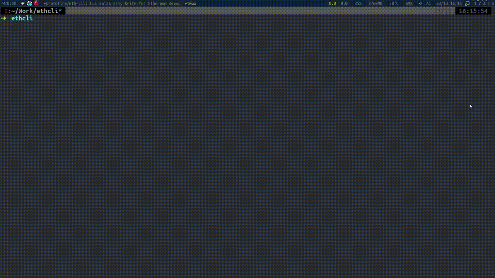

## Examples

### Install eth-cli

Run `npm i eth-cli -g` to install the eth-cli package.

### Call methods on deployed contracts

Use `contract:call` to call methods on contracts deployed on any network.

### Start an interactive REPL connected to some node

Use `eth repl` to start an interactive REPL connected to an Ethereum node.

